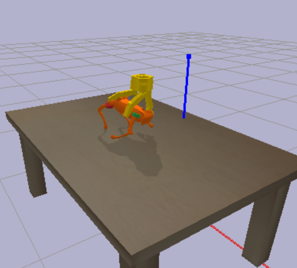
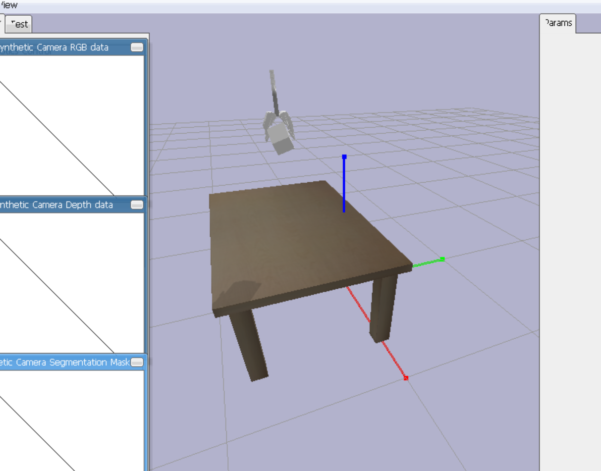
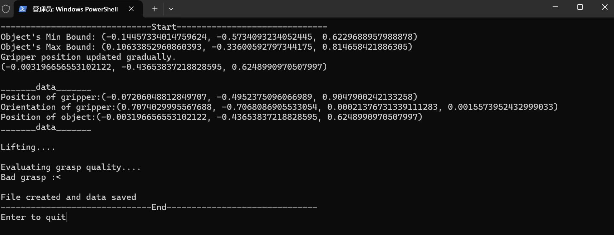
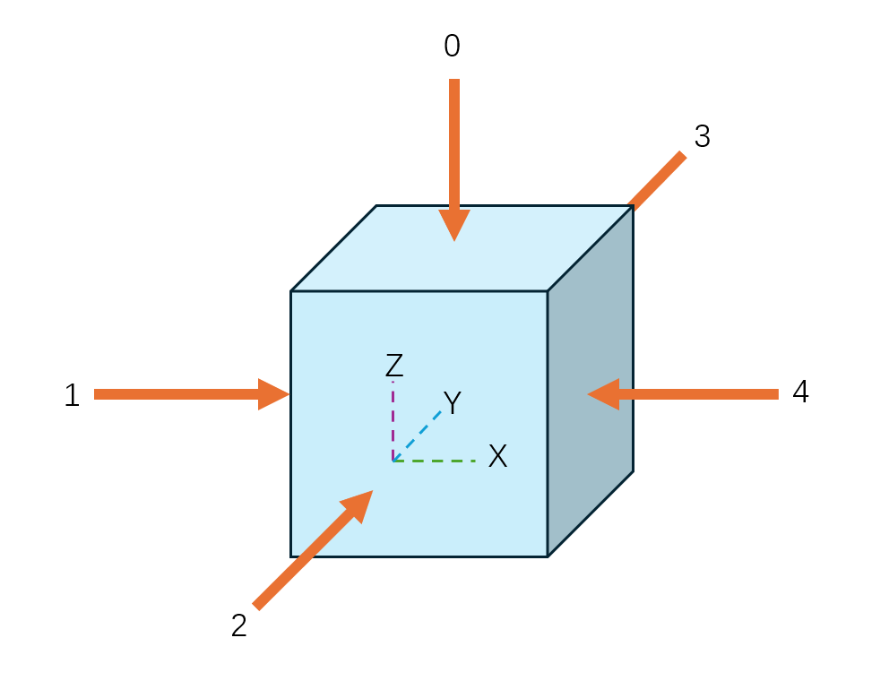

# Grasp Simulation and Data Collection

---

This project demonstrates a simulation of robotic grippers using **PyBullet**. The simulation enables the gripper to perform random grasp attempts on an object (e.g., a small cube), evaluate the grasp quality, and save the collected data for further analysis.
<div align="center">
    
    
    
</div>


---

## **Features**
1. **Random Grasping**:  
   The gripper performs randomized grasps using noise-based position generation around the object.
   
2. **Grasp Quality Evaluation**:  
   Determines whether the grasp is successful by evaluating the grasping duration without slippage.

3. **Data Collection**:  
   Saves gripper and object positions, orientations, and grasp quality labels (success/failure) to a CSV file.

4. **GUI and Headless Modes**:  
   Supports running the simulation with GUI visualization or in headless mode for batch data collection.

   - **GUI Mode**: Used for debugging or observing the simulation process.

   - **Headless Mode**: Used for efficiently running simulations in batches, saving resources and time.

---

## **Dependencies**
- Python 3.6+
- Download **env_requirement.txt**.  
  Run the following command to install all the packages:
   ```python
   pip install -r requirements.txt
   ```
---

## **Usage**
### **Function Parameters**
**GripperType** - Select the type of gripper to grasp object,PR2 / F3  
  
**where** - Select the direction around the object to generate random grasp  
  
**ObjectName** - Select the object to grasp.  
  
**batch_size** - Number of grasps to simulate and save the data in `data.csv`  

**Mode** - 0 for Debugging mode, 1 for DataColletion
  
  


---
  
### **Run Single Grasp in GUI**
For debugging or visualizing the grasping process, use:
```python
a=RUN('F3',**1**,'cube',500,0)
```
This will load the environment, perform a single grasp at selected direction (1), and display the simulation in a GUI.  
  
### **Batch Data Collection**

#### **Without GUI (Headless Mode)**
For faster batch data collection:
```python
a=RUN('F3',1,'cube',**100**,**1**)
```
- Simulates 100 grasps at selected direction without rendering the GUI.
- Saves the data in `data.csv`.

#### **With GUI**
To visualize each grasp while collecting data, Change the parameters of the following code from DIRECT to GUI.  
This code is under **DataCollection(self)** method in classes.
```python
p.connect(p.GUI)
```
  
---

## **Data Structure**
The collected data is saved in a CSV file (`data.csv`) with the following fields:

| Column       | Description                                |
|--------------|--------------------------------------------|
| Ori_x, Ori_y, Ori_z, Ori_w | Orientation of the gripper in quaternion format. |
| Pos_x, Pos_y, Pos_z        | Position of the gripper (base frame).             |
| Obj_Pos_x, Obj_Pos_y, Obj_Pos_z | Position of the object.                        |
| Label         | Grasp quality: `1` for success, `0` for failure. |

---

## **Simulation Workflow**
1. **Initialization**:  
   Sets up the environment with a table, a small cube, and a PR2/F3 gripper.

2. **Grasp Execution**:  
   - Generates a random position around the object.  
   - Moves the gripper to the target position and closes its fingers to grasp the object.  
   - Lifts the object to evaluate the grasp.

3. **Data Saving**:  
   Captures the positions, orientations, and grasp quality in a structured format and appends them to the CSV file.

---

## **Key Functions**

| Function                  | Description                                                   |
|---------------------------|---------------------------------------------------------------|
| `random_position`         | Generates a random grasp position around the object.          |
| `update_gripper_direction`| Moves the gripper to the target position and orientation.      |
| `grasp`                   | Closes the gripper's fingers to grasp the object.             |
| `lifting`                 | Lifts the object slowly after grasping.                       |
| `getdata`                 | Captures and logs positions and orientations of the gripper and object. |
| `is_successful`           | Evaluates grasp quality based on contact points.              |
| `SaveData`                | Saves collected data to a CSV file.                           |

---

## **Environment Setup**
- **Objects**:  
  - PR2/F3 Gripper (`pr2_gripper.urdf`)  
  - Table (`table.urdf`)  
  - Cube (`cube_small.urdf` with global scaling).

- **Physics**:  
  - Gravity: `-10 m/s²`.  
  - Simulation Steps: Continuous during grasping and lifting.

---

## **Example Output**
A snapshot of the collected data in `data.csv`:
```csv
Ori_x,Ori_y,Ori_z,Ori_w,Pos_x,Pos_y,Pos_z,Obj_Pos_x,Obj_Pos_y,Obj_Pos_z,Label
0.0,1.0,0.0,0.0,0.05,0.0,0.5,0.0,-0.4,0.62,1
-0.2,0.98,0.0,0.0,0.04,-0.1,0.6,0.02,-0.38,0.65,0
...
```

---

## **Future Improvements**
- Add support for different object shapes and sizes.
- Introduce reinforcement learning for better grasping strategies.

---

